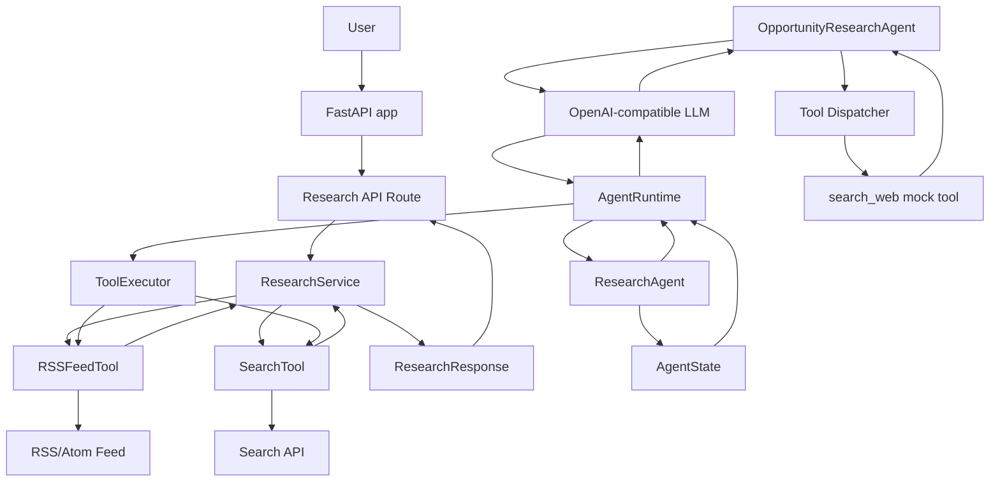

# Architecture

## 系统目标

本项目用于支撑 Java 后端工程师向 Agent Engineer 转型的三个月学习与实战。

系统目标包括：

- 沉淀 Agent 学习路线和学习状态。
- 通过小型 TASK 逐步实现 Agent 能力。
- 记录架构演进和重要技术决策。
- 为 Codex 与 ChatGPT 提供稳定、简洁的上下文同步入口。

## 模块划分

| Module | Responsibility |
| --- | --- |
| `docs/` | 存放学习路线、学习状态、能力矩阵、AI 上下文、架构和决策 |
| `tasks/` | 存放后续独立任务说明 |
| `notes/` | 存放学习笔记和临时理解 |
| `src/app/main.py` | FastAPI 应用创建和 Uvicorn 本地启动入口 |
| `src/app/api/research.py` | `/research` HTTP API 路由和异常到 HTTP 状态码的转换 |
| `src/app/services/research_service.py` | 编排 RSS/Search 工具，完成 `RSSItem`、`SearchResult` 到 `Evidence` 的转换 |
| `src/app/agents/research_agent.py` | Day05-Day07 业务 Agent，负责 prompt、Tool Schema、RSS/Search 工具注册、LLM 调用、State 创建和最终结构化输出校验 |
| `src/app/agents/state.py` | `AgentState` 和 `AgentStatus`，保存一次 Agent 运行的可观察执行状态 |
| `src/app/agents/runtime.py` | Day06-Day07 轻量 Agent Runtime，负责多步 loop、State 更新、`max_steps`、ToolExecutor、Tool Error Boundary 和 Execution Trace |
| `src/app/tools/rss_tool.py` | 请求并解析 RSS/Atom feed，输出 `RSSItem` |
| `src/app/tools/search_tool.py` | 请求并解析 Search API，输出 `SearchResult` |
| `src/app/tools/__init__.py` | Day3 legacy Agent tool dispatcher 和 mock `search_web` tool |
| `src/app/schemas/research.py` | `ResearchRequest`、`ResearchResponse`、`Evidence` 等结构化模型 |
| `src/app/agent.py` | Day3 Tool Calling Agent Loop，当前主要由测试覆盖 |
| `tests/` | API、Service、Tool、Schema、Agent Loop 和 app 装配测试 |
| `examples/` | 存放后续示例代码 |

## 调用链

### 当前 `/research` API 调用链

```text
用户 HTTP 请求
  -> FastAPI app
  -> app/api/research.py
  -> ResearchService.research()
  -> RSSFeedTool.fetch()
  -> 外部 RSS/Atom feed
  -> RSSItem
  -> SearchTool.search()
  -> 外部 Search API
  -> SearchResult
  -> Evidence
  -> ResearchResponse
  -> HTTP JSON response
```

### 当前 Agent Loop 调用链

```text
调用 ResearchAgent.research(goal)
  -> 创建 AgentState(status=pending, current_step=0)
  -> AgentRuntime.run(state)
  -> State.status=running
  -> LLM chat.completions.create()
  -> LLM 根据 Tool Schema 选择 search_web 或 rss_feed
  -> ToolExecutor registry
  -> 解析并校验 tool_call.function.arguments
  -> SearchTool.search(query) 或 RSSFeedTool.fetch()
  -> Tool Result 或 Tool Error 序列化为 ok=true/ok=false Observation JSON
  -> Observation 写入 AgentState.observations
  -> append 到 AgentState.messages
  -> LLM 读取 tool observation 并继续决策，直到 final answer 或 max_steps
  -> final JSON 通过 Pydantic 校验
  -> ResearchResponse 写入 AgentState.final_result
  -> AgentState.status=completed，或 max_steps/error
  -> ResearchResponse，并可通过 trace 查看执行轨迹
```

## 数据流

当前主要业务数据流：

```text
ResearchRequest.topic
    -> RSS/Search query and filtering
    -> RSSItem / SearchResult
    -> Evidence
    -> ResearchResponse
```

Agent 执行状态数据流：

```text
goal
  -> AgentState
  -> AgentRuntime 更新 current_step
  -> ToolObservation 写入 observations
  -> final/max_steps/error 更新 status 和 final_result
```

## 外部系统

- OpenAI-compatible LLM API：由 `OpportunityResearchAgent` 和 `ResearchAgent` 使用，支持 OpenAI 和 DeepSeek 配置。
- RSS/Atom feed：由 `RSSFeedTool` 获取。
- Search API：当前默认配置为 Wikipedia Search API compatible endpoint。

## 当前架构图



## 当前边界说明

- `ResearchService` 是当前 `/research` 的业务入口，负责从工具结果构造 Agent 领域响应。
- `RSSFeedTool` 和 `SearchTool` 当前更接近外部数据源 client/tool 混合体，尚未进一步拆分。
- `ResearchAgent` 是 Day05-Day07 的 Agent 学习入口，负责业务 prompt、Tool Schema、真实工具注册、创建 State 和最终 `ResearchResponse` 校验；当前未接入 HTTP API。
- `AgentState` 表示可观察、可测试、可恢复的单次执行状态，不包含 hidden Chain-of-Thought、Secret、Tool 实例或数据库连接。
- `AgentRuntime` 负责通用 loop、State 的 step/status/result 更新、tool observation 回填、`max_steps` 终止和 trace，不包含 Opportunity Research 业务规则。
- `ToolExecutor` 负责 Tool Registry、参数解析、工具执行和错误 observation，避免 Agent 主循环直接了解每个工具实现。
- `OpportunityResearchAgent` 保留 Day3 legacy Tool Calling 学习调用链。
